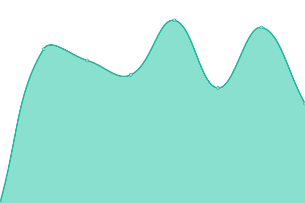
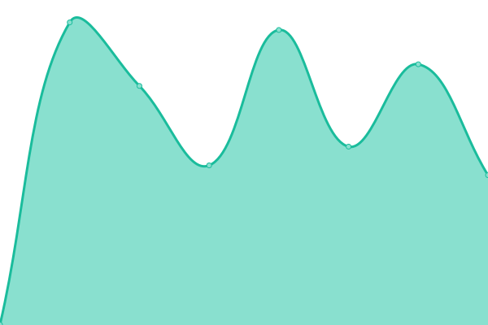

# [📈 Live Status](https://status.aksuma.ru): <!--live status--> **🟥 Complete outage**

This repository contains the open-source uptime monitor and status page for [Denis Danilov](vk.com/aksuma), powered by [Upptime](https://github.com/upptime/upptime).

With [Upptime](https://upptime.js.org), you can get your own unlimited and free uptime monitor and status page, powered entirely by a GitHub repository. We use [Issues](https://github.com/AipNooBest/aksuma-uptime/issues) as incident reports, [Actions](https://github.com/AipNooBest/aksuma-uptime/actions) as uptime monitors, and [Pages](https://status.aksuma.ru) for the status page.

<!--start: status pages-->
<!-- This summary is generated by Upptime (https://github.com/upptime/upptime) -->
<!-- Do not edit this manually, your changes will be overwritten -->
<!-- prettier-ignore -->
| URL | Status | History | Response Time | Uptime |
| --- | ------ | ------- | ------------- | ------ |
|  [Main Site](https://aksuma.ru/) | Оффлайн | [main-site.yml](https://github.com/AipNooBest/aksuma-uptime/commits/HEAD/history/main-site.yml) | 

 643мс
     
 | 

<a href="https://status.aksuma.ru/history/main-site">79.41%</a>
    

|  [Osu Server (Frontend)](https://osu.aksuma.ru/) | Оффлайн | [osu-server-frontend.yml](https://github.com/AipNooBest/aksuma-uptime/commits/HEAD/history/osu-server-frontend.yml) | 

 629мс
     
 | 

<a href="https://status.aksuma.ru/history/osu-server-frontend">2.60%</a>
    

|  [Osu Server (Backend)](https://c.aksuma.ru/) | Оффлайн | [osu-server-backend.yml](https://github.com/AipNooBest/aksuma-uptime/commits/HEAD/history/osu-server-backend.yml) | 

 611мс
     
 | 

<a href="https://status.aksuma.ru/history/osu-server-backend">2.60%</a>
    

|  [Wiki](https://wiki.aksuma.ru/) | Оффлайн | [wiki.yml](https://github.com/AipNooBest/aksuma-uptime/commits/HEAD/history/wiki.yml) | 

 634мс
     
 | 

<a href="https://status.aksuma.ru/history/wiki">79.32%</a>
    

|  [File Storage](https://fs.aksuma.ru/) | Оффлайн | [file-storage.yml](https://github.com/AipNooBest/aksuma-uptime/commits/HEAD/history/file-storage.yml) | 

 619мс
     
 | 

<a href="https://status.aksuma.ru/history/file-storage">78.47%</a>
    

|  [Gitea](https://git.aksuma.ru/) | Оффлайн | [gitea.yml](https://github.com/AipNooBest/aksuma-uptime/commits/HEAD/history/gitea.yml) | 

 720мс
     
 | 

<a href="https://status.aksuma.ru/history/gitea">78.47%</a>
    

<!--end: status pages-->

[**Visit our status website →**](https://status.aksuma.ru)

## 📄 License

- Powered by: [Upptime](https://github.com/upptime/upptime)
- Code: [MIT](./LICENSE) © [Anand Chowdhary](https://anandchowdhary.com), supported by [Pabio](https://pabio.com)
- Data in the `./history` directory: [Open Database License](https://opendatacommons.org/licenses/odbl/1-0/)
